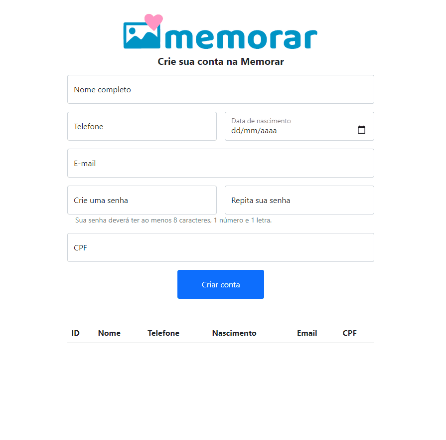

<h1 align="center"></h1>

<h3 align="center">Formulário Memorar</h3>

<p align="center">“Software developers are students forever 🧠”</p>

<p align="center">
  <a href="#about">Sobre</a>&nbsp;&nbsp;&nbsp;|&nbsp;&nbsp;&nbsp;
  <a href="#install">Instalação</a>&nbsp;&nbsp;&nbsp;|&nbsp;&nbsp;&nbsp;
  <a href="#challenge">Desafios</a>&nbsp;&nbsp;&nbsp;|&nbsp;&nbsp;&nbsp;
  <a href="#technologies">Tecnologias</a>
</p>

## :speech_balloon: Sobre <a name="about"></a>

> Essa aplicação é o front-end de um desafio prático desenvolvido pela empresa [Auryn Web To Print](https://www.auryn.com.br/). O objetivo foi construir um formulário de cadastro utilizando Vue.

<br />
<table>
  <tr>
    <td colspan="1">Web</td>
  </tr>
  <tr>
    <td></td></td>
  </tr>
</table>

## :warning: Instalação <a name="install"></a>

```bash
# Configurar o back-end disponível abaixo:
$ ...

# Instalar as dependências necessárias:
$ yarn ou npm install

# Iniciar o projeto:
$ yarn serve ou npm run serve
```

## :triangular_flag_on_post: Desafio <a name="challenge"></a>

> O desafio principal foi o primeiro contato com o Vue. Através dessa aplicação foi possível analisar a estrutura, sintaxe e semântica básicas de uma aplicação utilizando essa tecnologia.

## :heavy_check_mark: Tecnologias <a name="technologies"></a>

- [Vue](https://vuejs.org/)
- [JavaScript](https://developer.mozilla.org/pt-BR/docs/Web/JavaScript)

---

by [Douglas Scaini](https://www.github.com/douglasscaini) ❤️
